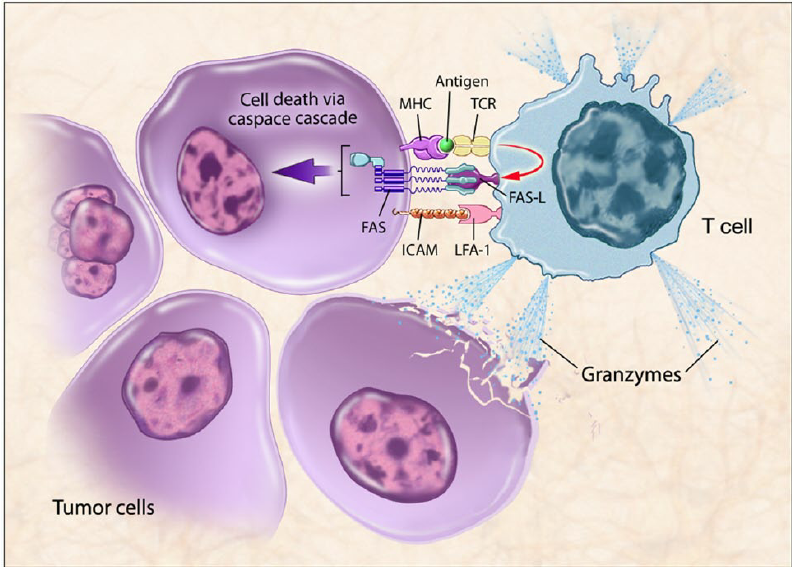

# LYnet
> 2022/12/2  

> 
An improved machine-learning based prediction tool for identifying tumor T cell antigens（TTCA）
was implemented in python 3.7

# Benchmark dataset
This file contains all standard protein sequences used in this project.  
Including:  
1--iTTCA-RF dataset Train.FASTA  
2--iTTCA-RF dataset Test.FASTA  
3--TAP 1.0 dataset positive.txt  
4--TAP 1.0 dataset negative.txt  
# Other_models_code
This file contains the feature data recurrence code of the previous three models.  
Including:  
1--iTTCA-Hybrid  
2--TAP 1.0  
3--iTTCA-RF  
# Related_files
This file contains previous research papers, data sets and calculated AUC(Area Under Curve) data files.  
Including:  
1--Five related research papers  
2--3-datasets-4-models  
3--data_AUC_plot  
# Step1 Feature_extraction
This file contains all feature files extracted by Benchmark dataset.  
Including:  
1--n_p  
2--Tr_Te  
# Step2 Model_training_validation
This file contains the test results of LYnet model on Benchmark dataset.  
Including:  
1--data2  
2--data3  
3--data4  
4--data_all  
5--bestnpz  
